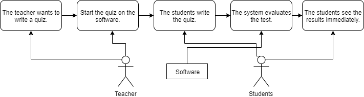

# Requirement specification
## Desired system
With the system in place, the school can reduce paper usage, and ease the
teachers' work. The user interface is intuitive and easy to use. The test
questions and the mode of evaluation can be chosen by the teacher. The
students get the test in a randomized order, reducing the risk of cheating.
### Reports-from-the-test-results
The system immediately evaluates and grades the test, and sends the result
in an email to the student. Furthermore, the teacher gets a notification
from the whole class's performance. Lastly, the headmaster gets a list of
all the failing grades in each month, helping him to identify the students
who struggle with their studies and need help.
# Functional specification
## Desired system
The system is a web application with responsive design, meaning it will work
on computers and phones too. The system is secure and it is accessible only
with correct identification. Personal information is always kept private.
After signing in the teachers can add, modify, or delete questions in the
database. The multiple-choice questions can have one or more correct answers.
The point value of the questions can be set too. The teachers can assemble
their required tests from these questions or generate a test randomly from
the database. In class, they can give access for the students to take the test in the given timeframe. The test results are sent as described in the
requirement specification under the [Reports form the test results](#reports-from-the-test-results) paragraph.
## Model of requested business processes
